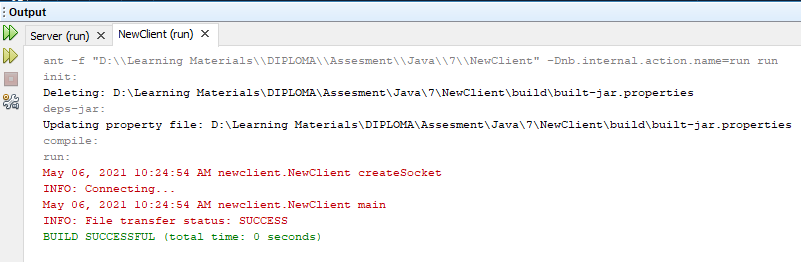
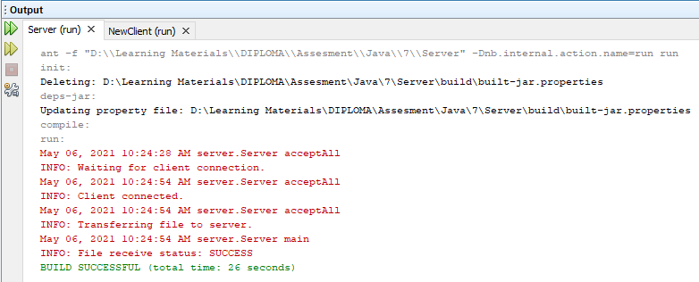

<!DOCTYPE html>
<html>
<head>
</head>
<body>

<h2>CVS File Exchange</h2>

This program simply transfers files between the server and client. 
Using port which was little pain in bottom but it works perfectly :) 

 

    
    

</body>
</html>