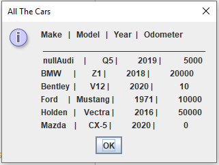
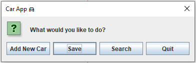
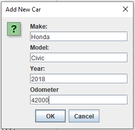
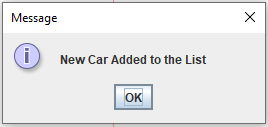
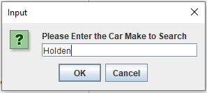
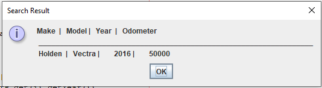
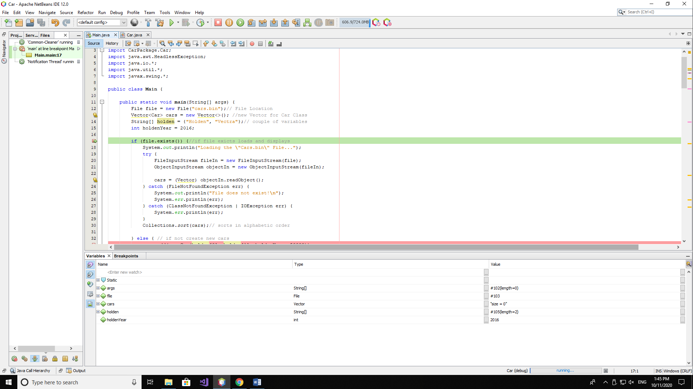
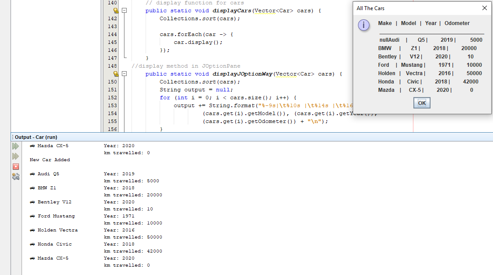
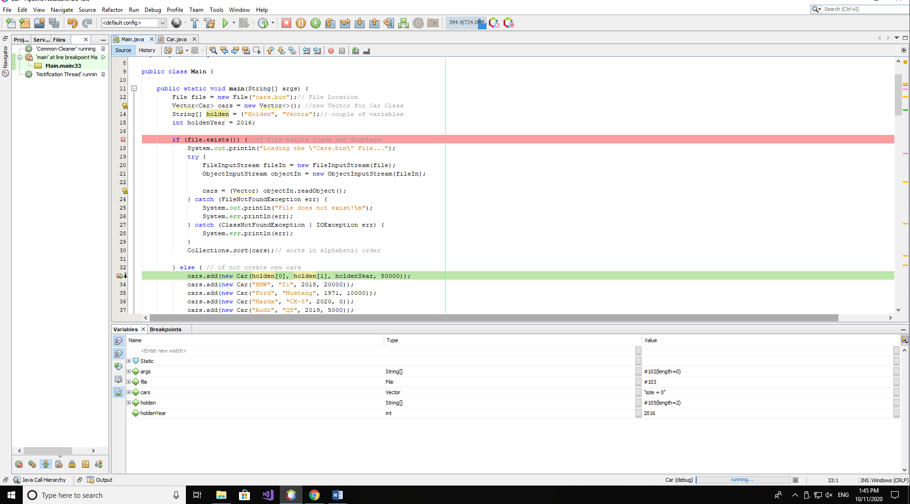

<!DOCTYPE html>
<html>
<body>

<h2>Car Dealer Application</h2>

This Software designed for car dealers who wish create a database and control their stock on their system. 
It's the back end part. 
 

<!--   
 -->
    
<!--   

  
 -->
    
<!--   

  
 -->
    
<!--   

  
 -->
    
<!--   

  
 -->
    
<!--   

  
 -->
    
<!--   

  
 -->
    
    
    
    
<!--   
 -->

</body>
</html>
