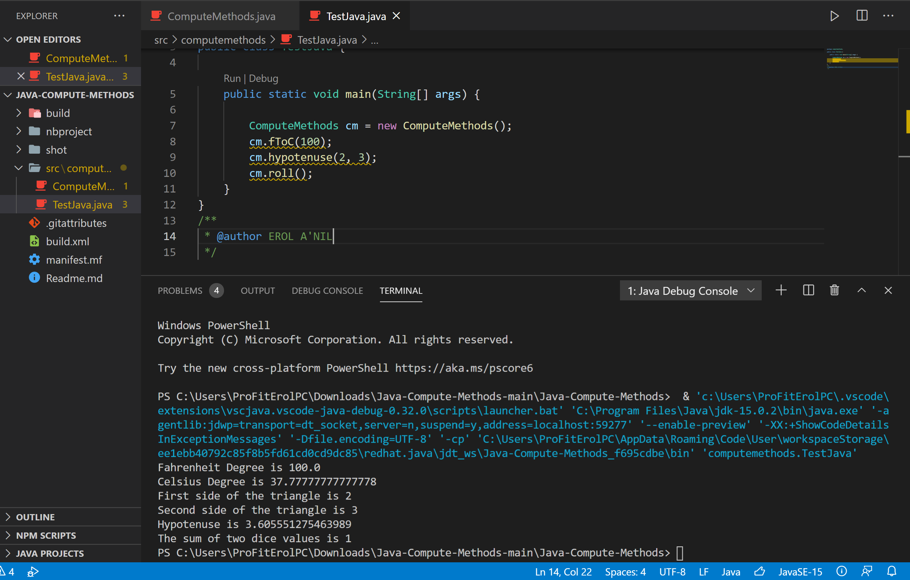

<!DOCTYPE html>
<html>
<head>
</head>
<body>

<h2>Weather Calculations</h2>

In this example you will see how easy to calculate or convert things with Java. 
Check the example below 
 

</body>
</html>