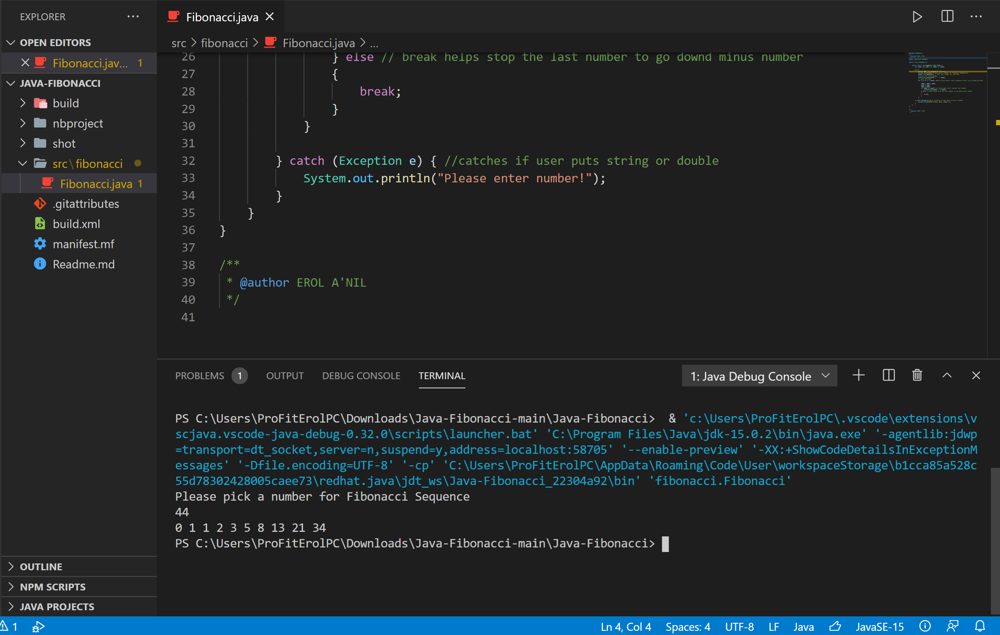

<!DOCTYPE html>
<html>
<head>
</head>
<body>
<h2>Fibonacci on Java</h2>

This example will give you an idea how to implement Fibonacci sequence 
This application showed me how easy to use java when it comes to Math 
   

</body>
</html>