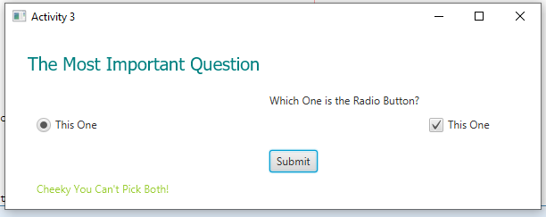

<!DOCTYPE html>
<html>
<head>
</head>
<body>

<h2>Firt JavaFX Application</h2>

This is great way to get your hands on JavaFX. 
JavaFX is little old school but still provides great UI for users 
In this application you'll come across so many interesting things 
that you could do .net Form app but in Java 
 

</body>
</html>
