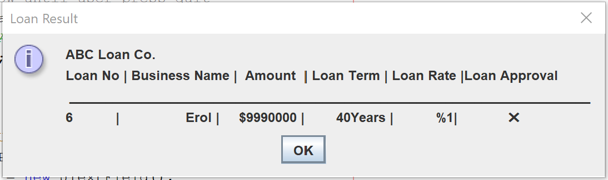
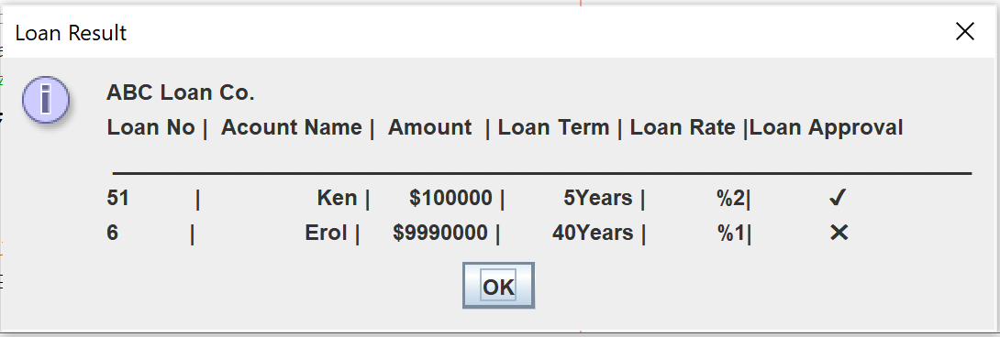

<!DOCTYPE html>
<html>
<head>
</head>
<body>

<h2>Java Loan App</h2>

It checks if you are eligiable for loan. If so, receices loan amount 
calculates and it gives you the result 
I found quite cool :)  
 

</body>
</html>
