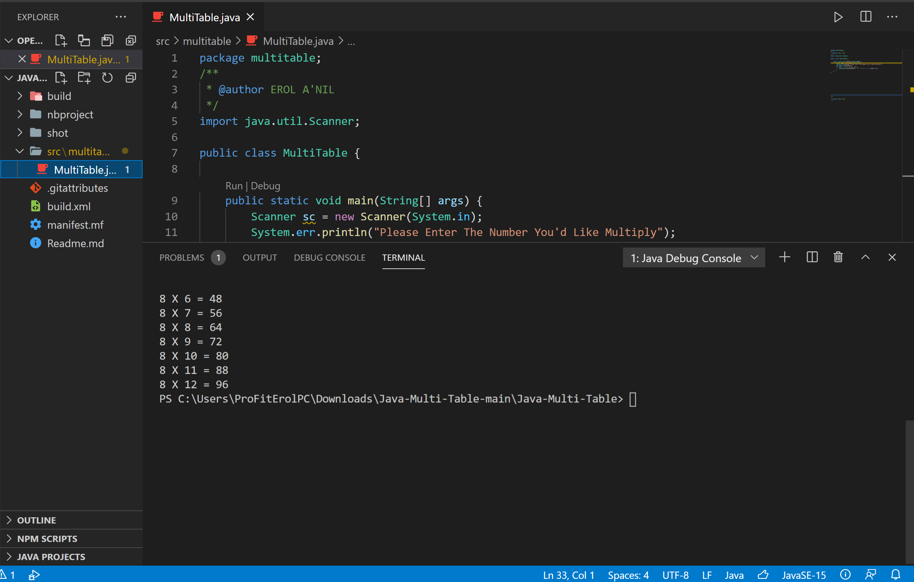

<!DOCTYPE html>
<html>
<head>
</head>
<body>

<h2>Multiplying with Java</h2>

Another Learning Material how to combine Math with Java 
This application takes any integer and multiplies without carring the byte value :) 
   

</body>
</html>
