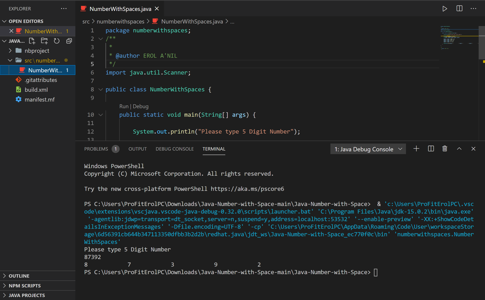

<!DOCTYPE html>
<html>
<head>
</head>
<body>

<h2>Learning Java Tricks</h2>

In this example We learnt about java short keys to reduce the amount code we type in & 
little bits & pieces about Java 
   

</body>
</html>
