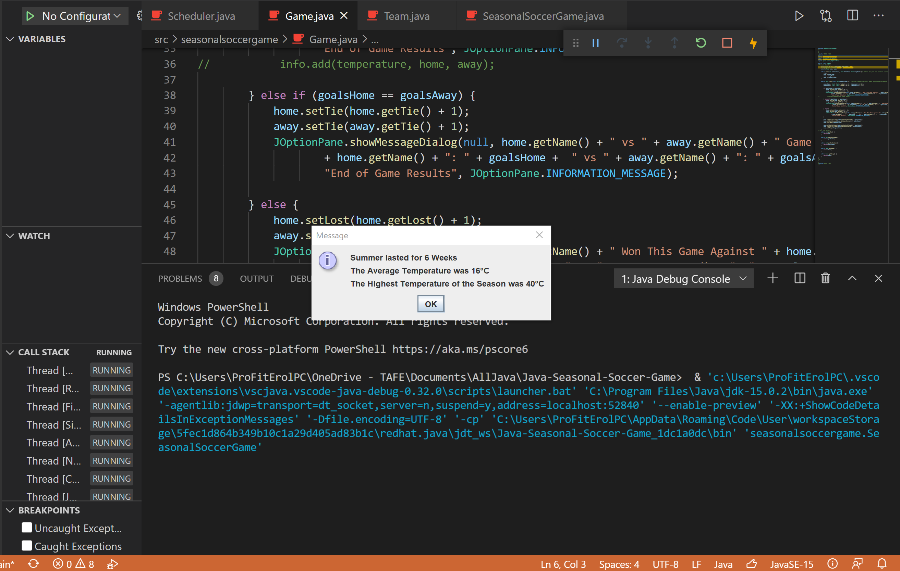

<!DOCTYPE html>
<html>
<head>
</head>
<body>

<h2>Soccer Seasonal League</h2>

Small extention package to Soccer game back end. 
Where they only play soccer during the summer. 
Once weather gets cold 3 weeks in a row game finishes. 
   

</body>
</html>
