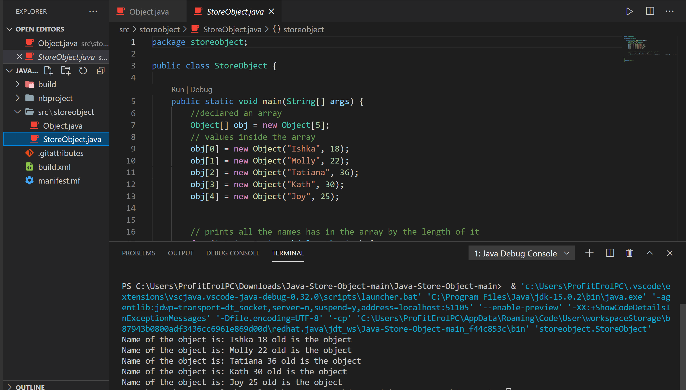

<!DOCTYPE html>
<html>
<head>
</head>
<body>

<h2>Storing Objects in Java</h2>

That's where I learnt how to store object in java at this stage it's just names but imagine 
things you could store widgets any types of objects, data,button you name it..

</body>
</html>
