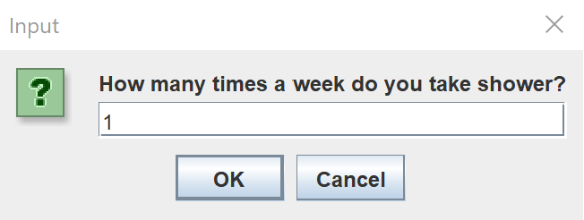

<!DOCTYPE html>
<html>
<head>
</head>
<body>

<h2>Java StoryTeller</h2>

Custom Application Collects information from the user. 
And Creates Story about them. 
And also it tests your General knowledge as I failed on last pic :) 
   

</body>
</html>
