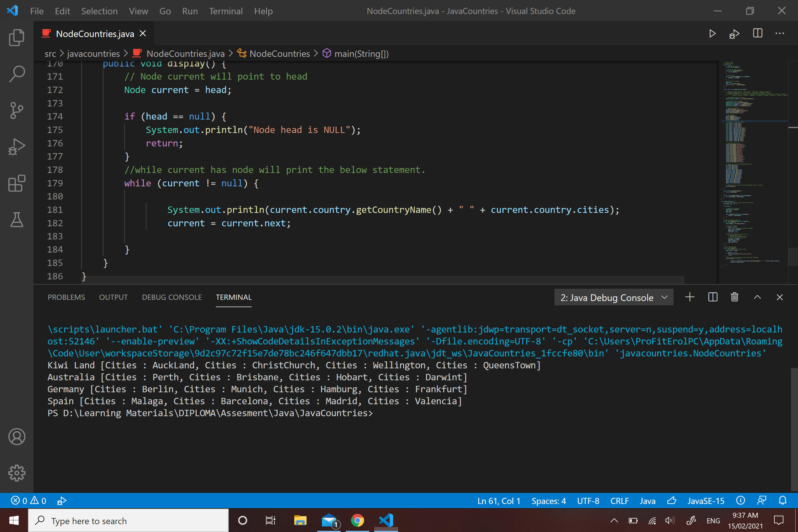
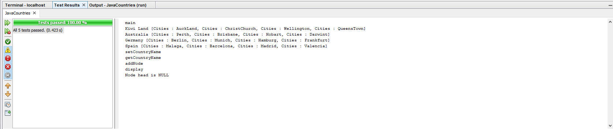

<!DOCTYPE html>
<html>
<head>
</head>
<body>
<h2>Java Countries</h2>

During the my Java course we have learnt about Nodes and I come up with this application. 
Where adding new Nodes or removing them. 
Nothing too excitinng learning Nodes adding Countries and Cities to a console 
 

</body>
</html>
