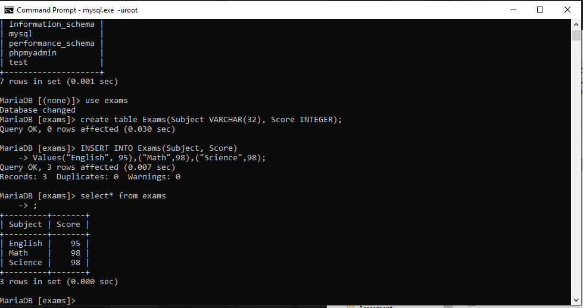
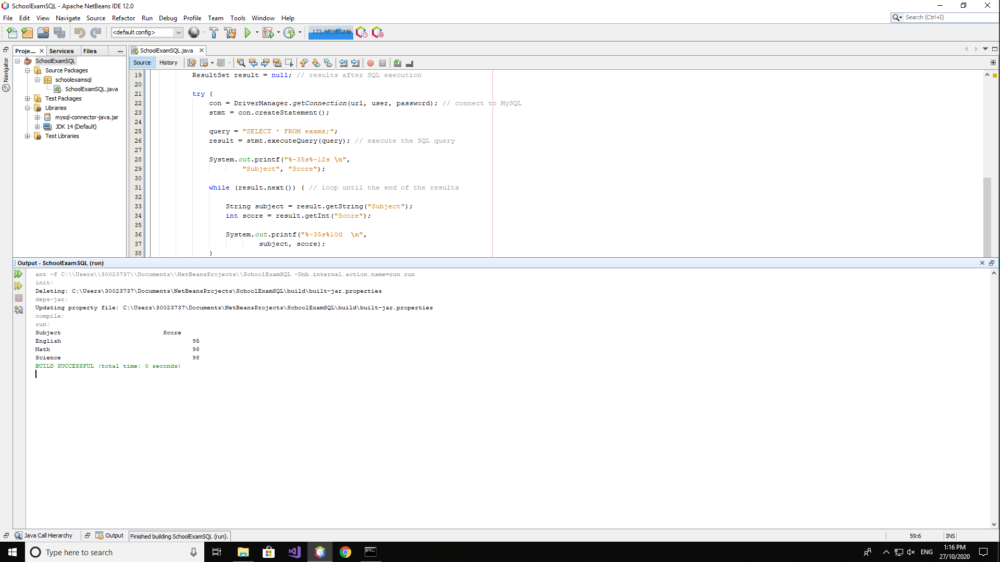

<!DOCTYPE html>
<html>
<head>
</head>
<body>

<h2>Connecting Java App to SQL</h2>

As this was part of my assignment. This application connects to SQL(database) 
creates a new table or checks for existing one and inserts data on there. 
I found super useful to store data for teachers store students data. 
   

</body>
</html>
