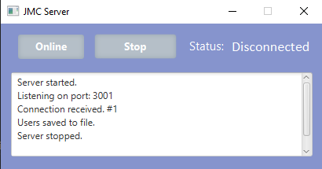
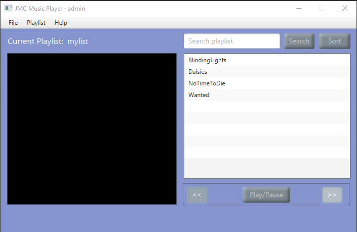

<!DOCTYPE html>
<html>
<head>
</head>
<body>

<h2>Java Project</h2>

This project made for my last assignment. Using JavaFX & third party libraries 
You'll come across beautiful UI made in SceneBuilder & great functionalities provides 
searhing, sorting, adding, removing, saving, loading & much more. 
This project was my last project & really hope that I won't touch java ever ever but ever again 
 

</body>
</html>